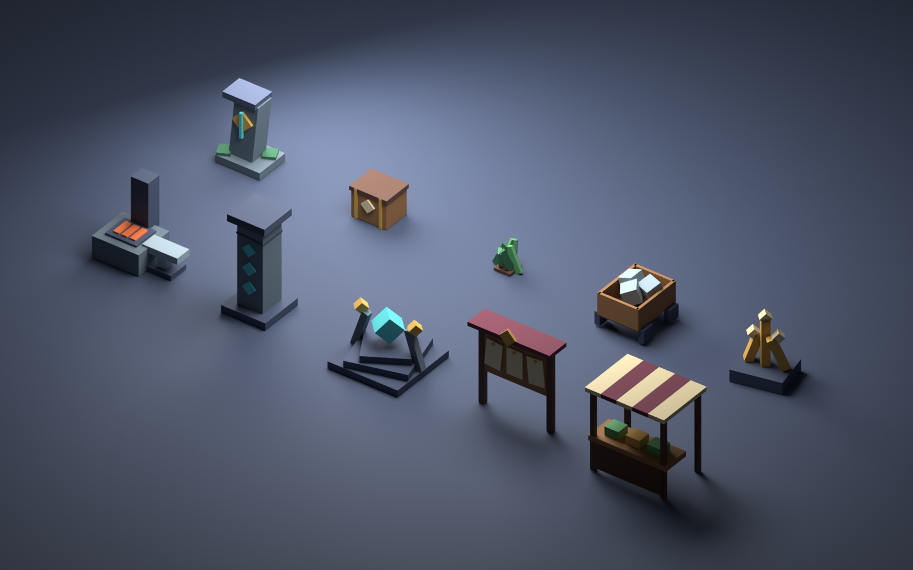

# Guildborne Adventure Kit

Ten original block-built low-poly props. Editable source: [Guildborne_Adventure_Kit.blend](Guildborne_Adventure_Kit.blend). Each asset has FBX and GLB exports at its ground pivot. Source positions use Y-up Roblox studs; Blender converts to (x,-z,y). Import scale and material behavior must still be verified before replacing a native model with an uploaded mesh.

| Region | Models |
| --- | --- |
| Greenwood | Waystone, Supply Cache, Fern |
| Ironveil | Ore Cart, Crystal Cluster, Forge |
| Ashen | Rune Pillar, Shrine |
| Shared | Adventurer Quest Board, Harbor Market Stall |

87 native parts, 1,044 exported triangles total. All native parts are anchored, noncolliding, nontouchable and nonqueryable. No scripts, prompts, rewards or commerce are embedded. Native templates were inspected and visually captured in Guildborne Staging through MCP. Nine decorative island placements were verified at 223 total scenery parts. FBX/GLB import and human art approval are pending; native verification does not certify a Roblox mesh upload.

Regenerate definitions using tools/build_adventure_kit.py, then run Blender in background with tools/blender_adventure_kit.py. The JSON definition and native AdventurePropKit module share sizes, transforms and palette. Export-report.json records per-model triangle counts, bounds and material counts. These are initial low-poly props, not completed character rigs, enemy AI or playable regions.
