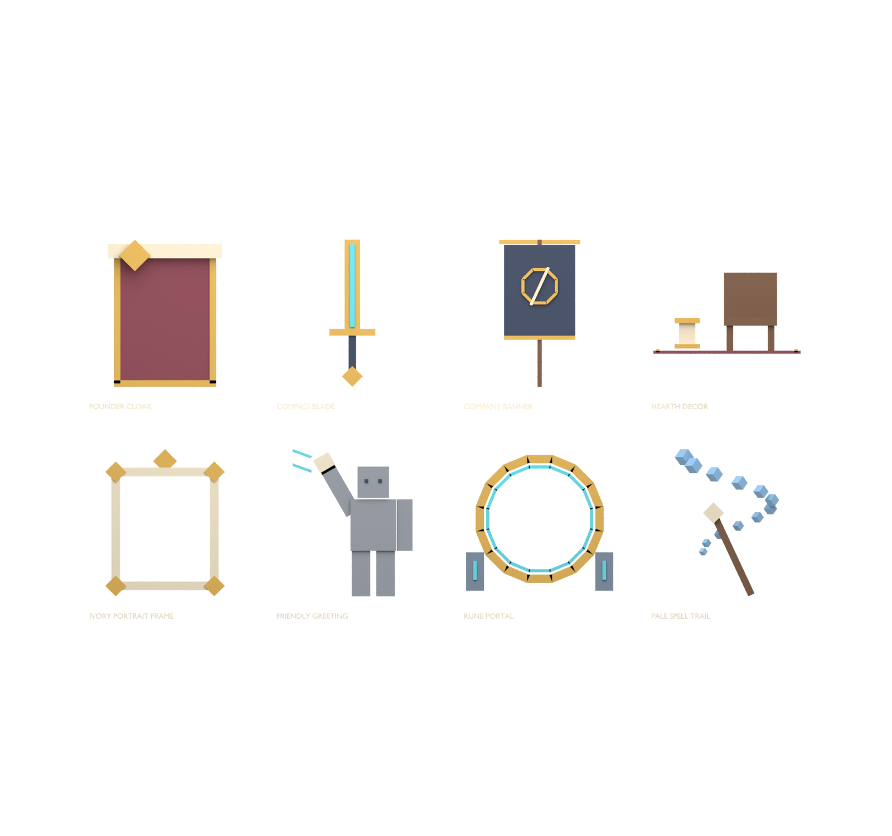

# Eight original cosmetic art prototypes

Founder cloak, compass blade, company banner, hearth decor set, ivory portrait frame, friendly greeting, rune portal and pale spell trail match the eight supplied cosmetic concepts.106native geometric pieces /1272triangles;8transparent512PNG icons;8FBX+8GLB meshes;editable `Guildborne_Cosmetic_Kit.blend`. All16mesh exports round-trip verified. Icons retain at least55px transparent margin.

`FriendlyGreeting.blend` and `friendly_greeting_Animation.fbx` add an actual61-frame30fps greeting on the custom Knight rig. Verification uses imported action frame bounds (FBX reimport offsets the start by one frame), confirms raised hand, stationary root and return to rest. The static greeting thumbnail is a presentation proxy. The portal and spell-trail models remain static effect prototypes, not completed VFX behavior. Cloak skinning, worn previews, device readability, entitlement delivery and live shop implementation remain pending.

The local Studio ServerStorage.CosmeticVisualKit contains8anchored noninteractive models. No price, ProductId, receipt handler, player ownership, stat bonus, live purchase or published asset is introduced.

Build `tools/build_cosmetic_kit.py` and `tools/generate_cosmetic_native.py`, then Blender `tools/blender_item_kit.py -- --kit assets/uat01/cosmetic-kit --name Guildborne_Cosmetic_Kit --max-triangles 600`. Validate with `tools/verify_item_kit.py -- --kit assets/uat01/cosmetic-kit` and Python `tools/audit_item_icons.py --kit assets/uat01/cosmetic-kit`. Greeting uses `tools/build_greeting_animation.py` and `tools/verify_greeting_animation.py`. Always use Blender `--python-exit-code 1`.

Settings integrates a local rotating preview via Shared.Data.CosmeticVisuals and client.UI.CosmeticPreview. Eight models passed framing at240/640px widths, localization, cycling and cleanup. This is a model preview, not a worn avatar try-on or entitlement implementation.
