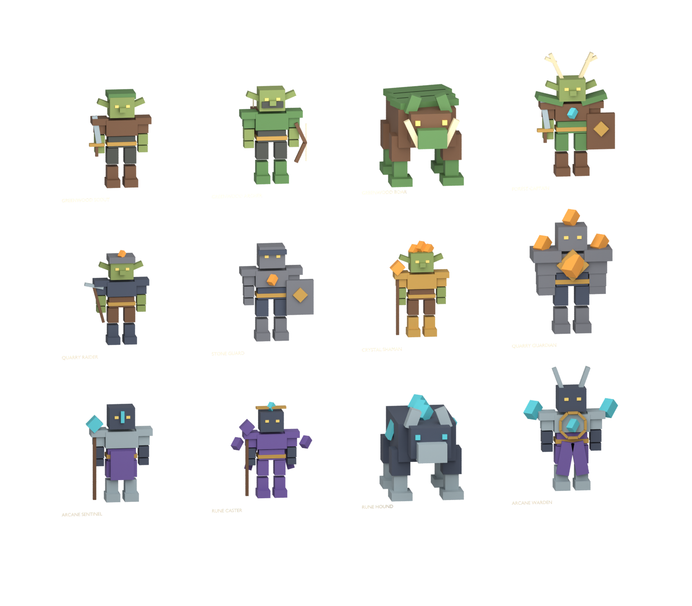

# Three-region enemy art and animation kit

Twelve original low-poly custom NPC designs follow the existing Guildborne concept roster. Greenwood: Scout, Archer, Boar, Forest Captain. Ironveil: Quarry Raider, Stone Guard, Crystal Shaman, Quarry Guardian. Ashen: Arcane Sentinel, Rune Caster, Rune Hound, Arcane Warden.

Ten humanoid and two quadruped rigs each have16bones. Total334native parts /4008mesh triangles. Every vertex has one normalized bone weight. Each individual editable `.blend` includes four30fps actions: Idle2s, Walk1s, Attack1.2s, Hit0.5s. All48clips are in-place visual candidates; attacks do not define authoritative damage windows. Rest FBX/GLB plus four animation FBXs per character total72portable files. The contact-sheet `.blend` is a separate rest-pose overview.

Rebuild `tools/build_adventure_enemies.py`, then run `tools/blender_enemy_kit.py` in Blender. Validate with `tools/verify_enemy_rigs.py`, always using `--python-exit-code 1`. All72exports reimported successfully with matching bones/triangles, normalized skin weights, sampled movement, stationary roots and seamless Idle/Walk endpoints. SHA256 evidence is in `roundtrip-report.json`.

`AdventureEnemyKit.luau` creates anchored, noncolliding static Roblox art templates with BindBone metadata. The12templates were installed in the local Studio `ServerStorage.AdventureEnemyKit` and verified334parts/3boss roles. They are not spawned as live enemies or loaded by runtime bootstrap. This separates art availability from unfinished regional encounters, AI roles, rewards and quests. No uploaded mesh or animation IDs, Roblox rig import/retarget certification, avatar certification or live-region completion is claimed.

`walk-preview.gif` reviews all12Walk clips sampled at24frames over approximately one second. It demonstrates in-place motion rather than locomotion/pathfinding or final foot-contact quality. Rebuild with `tools/render_enemy_motion.py` and `tools/assemble_enemy_preview.py`.

