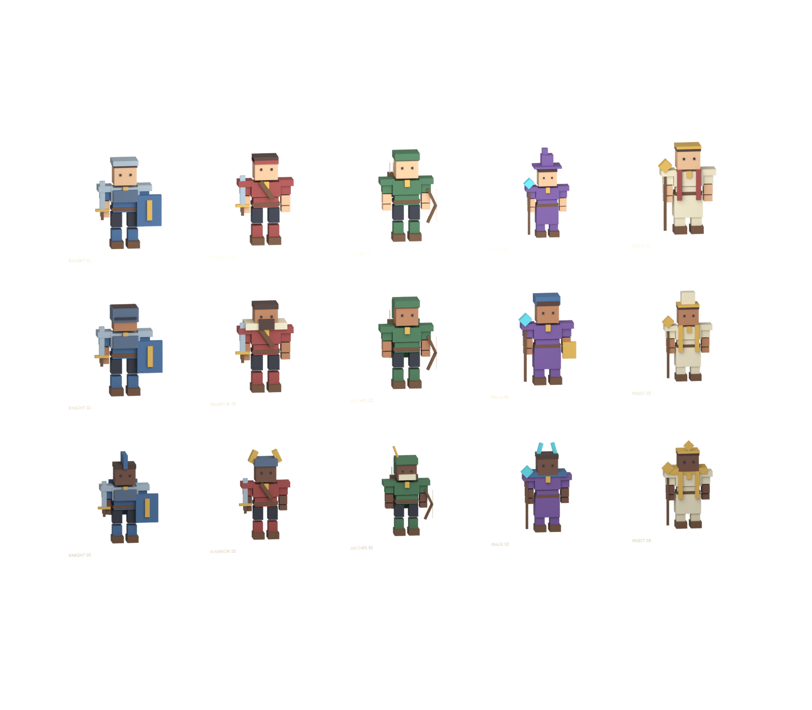

# Fifteen companion visual templates

All15`ui.heroes.{class}_{01..03}` slots from the supplied registry now have original models: Knight, Warrior, Archer, Mage and Priest with three silhouettes each. These are visual variants, not rarity tiers or stronger recruits. Skin tones are independent of power. No recruitment table, saved ownership or stat advantage is attached.

The kit contains439visible parts /5268triangles,15custom16-bone Blender rigs,15editable character files plus gallery,15portrait PNGs,15rest FBX+15rest GLB and60animation FBXs. Idle/Walk/Attack/Hit clips use the shared original procedural rig authoring pipeline. Every one of90exports passed reimport checks for bone/triangle counts, normalized weights, sampled movement, stationary root and loop seams. These are custom NPC rigs; avatar retargeting, animation blending and Roblox mesh/animation imports remain pending.

Native `HeroVisualKit` can create static previews or articulated Motor6D models. Studio probes passed15static models/439parts and15rigged models/679parts,225motors and439welds. Each rig has one anchored root; all visual geometry is noninteractive. The rigged template folder is installed in ServerStorage. It is not spawned by bootstrap, and has no Humanoid, movement AI, scripted animation player or uploaded IDs. Blender baked animation has not automatically become a Roblox animation asset.

The original visual pieces now also dress existing live R6 companions through `HeroAppearance`. Stable companion ID selects one of three class looks, independent of rank/spending. The adapter preserves all six locomotion joints, binds each piece to its matching limb and removes baked weapons so equipped inventory weapons remain authoritative. All15fits passed Studio checks; five actual Following companions moved9.9–14.1studs in a safe-guild test. This integrates appearance into existing companions; it does not add15new recruitment entitlements or import the separate16-bone Blender animations. Portraits now frame tall headgear and retain a64part bound.

Rebuild:

1. `python tools/build_hero_templates.py`
2. `python tools/generate_hero_native.py`
3. Blender `--background --python-exit-code 1 --python tools/blender_enemy_kit.py -- --kit assets/uat01/hero-kit --gallery Guildborne_Hero_Gallery`
4. Blender `--background --python-exit-code 1 --python tools/render_hero_gallery.py`
5. Blender `--background --python-exit-code 1 --python tools/verify_enemy_rigs.py -- --kit assets/uat01/hero-kit --count 15 --bosses 0`

