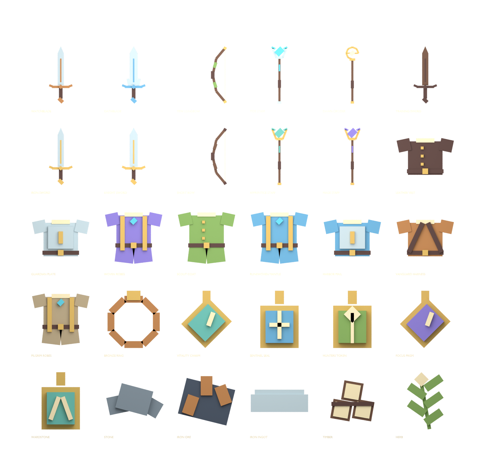

# Original inventory display kit

All30 current item IDs have original low-poly display geometry:11weapons,8armor pieces,6accessories and5materials. Total246native parts or2912mesh triangles. No statistics, ownership, price or reward changes are included.

Each item has a512×512transparent RGBA icon, FBX and GLB. `Guildborne_Item_Kit.blend` contains an editable contact-sheet scene. `kit.json` is the shared Y-up/stud geometry source; individual export origins and sizes are preserved. These are display/prop meshes, not skinned wearable clothing or UGC-certified assets.

Rebuild: `tools/build_item_visuals.py`, then Blender `tools/blender_item_kit.py` with `--python-exit-code 1`. Verify with `tools/verify_item_kit.py` in Blender and `tools/audit_item_icons.py` in Python with Pillow. All60exports passed round-trip checks. All30icons passed RGBA/nonempty/transparent-margin checks; minimum51pixels of transparent padding. Reports include SHA256 hashes.

The Inventory uses `ItemViewport.luau` and the generated shared `ItemVisuals.luau`, so these previews already work without uploaded texture IDs. Maximum16parts/item; no scripts, Humanoids, animation or physical interaction. Imported atlas art, when configured and loaded, replaces the native preview visually; an absent or loading atlas retains the native fallback. Materials have compact preview/count rows.

Studio fixture `tests/studio_item_viewports_probe.luau` passed all30items/246parts, every part-corner inside the square camera frustum, unknown-ID handling and physics isolation. Mesh/texture upload, production import and physical-device performance remain pending. Source descriptions and account-binding labels remain visible beside previews.

Native wearable integration: `WardrobeVisuals.luau` now equips the8armor and6accessory designs on existing rigs. Shoulder pieces bind to arms, rings to hands, and pendants to the torso.28synthetic fit/weld/cleanup cases and8standard neutral R15 cases passed. These welded native shapes still require motion/clipping review across arbitrary avatar proportions; mesh exports are not skinned clothing.

