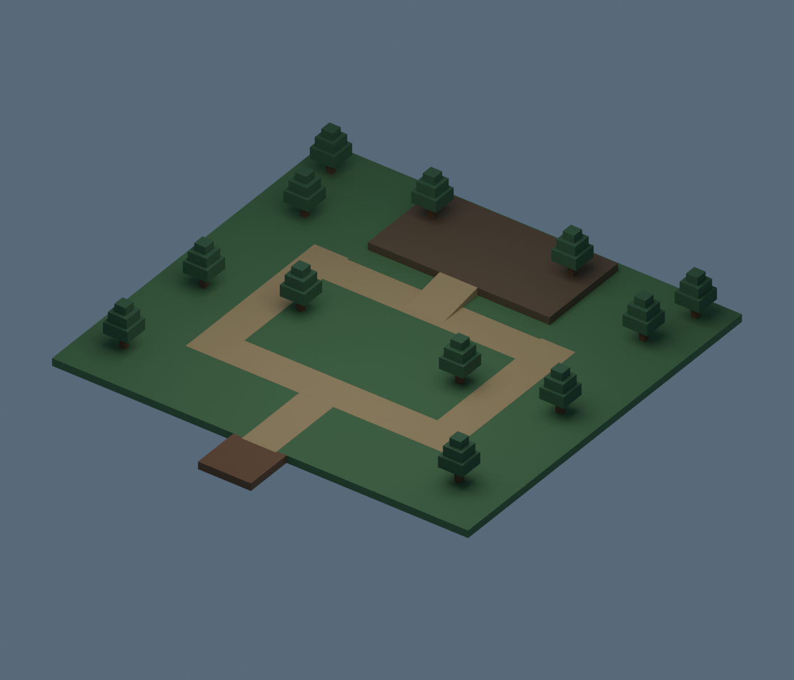
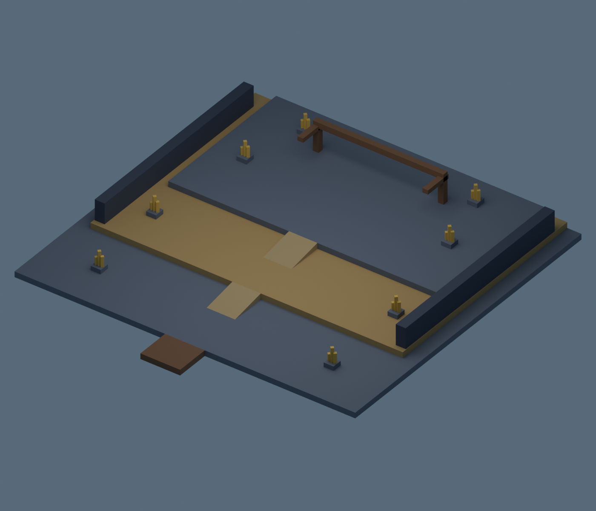
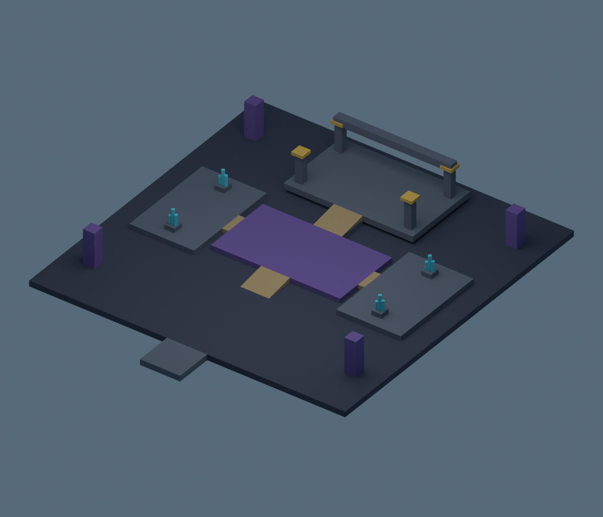

# Three original regional map shells

Greenwood Reach, Ironveil Quarry and Ashen Sanctum contain142native geometric pieces,9authored review routes and15arrival/encounter markers. Each region has an editable Blender file, FBX, GLB and rendered overview. The shared dataset generates the native `AdventureMapKit` and Blender geometry, including identical wedge orientation. Runtime traversal connects all three regions to city portals, with fallback landings, recovery and two gathering nodes each. Personal regional combat is bound only in the separate memory-only offline build; Staging/live activation remains disabled.

These are traversable blockouts, not final environment art or completed adventures. Collision surfaces, gentle ramps, readable regional color palettes and separate encounter spaces are implemented. Ambient dressing, full boundaries, live enemy behavior, rewards and regional story bindings remain incomplete. No uploaded IDs or public release.

`studio_region_routes_probe.luau` verifies2190floor samples across9routes, four-stud walking width, slopes below20degrees and15eight-stud encounter clearances. Actual maximum ramp slope is9.09degrees. Wedge AABB air is excluded from obstacle checks; a separate neutral R15 walking probe checks physical traversal. See validation evidence under docs/uat01.

Rebuild with `python tools/build_region_maps.py`, then Blender `--background --python-exit-code 1 --python tools/blender_region_maps.py`. Verify six mesh exports using `tools/verify_region_maps.py`. Models preserve separate geometry and materials; encounter markers remain in `.blend` and kit JSON, not exported meshes. Review routes are dataset/native metadata.

