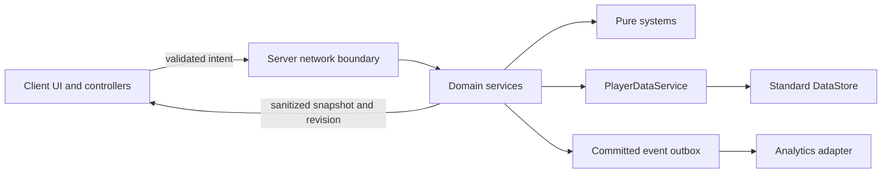

# Architecture

> Phase 4.5 update (2026-09-29): Phase 4.5 adds MarketEpochs, MarketHealth, MarketReconciliation and centralized namespace/private-acceptance configuration. Atomic per-item books remain; bounded archives/fences replace lifetime admission exhaustion. Offline recipients can delay an item rollover safely.
> See [implementation](PHASE4_5_IMPLEMENTATION.md), [operations](MARKET_OPERATIONS_RUNBOOK.md), and [verification](PHASE4_5_STUDIO_TEST.md). Prior phase text is historical.

> Current Phase 4 status (2026-09-29): Phase 4 adds MarketRuntime/MarketService orchestration, pure MarketOrders/Book/Matching/Escrow/Data/Protocol modules and a MarketCloud adapter. Single-key per-item CAS owns fills; profile-owner journals and book claims bridge records. No foreign worker writes a session-owned profile. MemoryStore projections and MessagingService are non-authoritative.
> See [implementation](PHASE4_IMPLEMENTATION.md), [Studio evidence](PHASE4_STUDIO_TEST.md), and [invariants](PHASE4_MARKET_INVARIANTS.md). Older sections below retain historical/planned scope.

> Phase 3 hub update — 2026-09-29: `CentralCityWorld`/`CityKit` generate the shared city; `TravelService`/`TravelRules` own validated travel, spawn clearance and recovery; `Shared.Config.City` holds destination/district geometry; `CityNavigation` provides the bilingual map. Hero trail grounding includes shared world surfaces and combat acquisition excludes city bounds. No persistence schema or economy expansion. See [city](CENTRAL_CITY.md), [travel](TRAVEL_SYSTEM.md) and [acceptance](PHASE3_STUDIO_TEST.md).

> Current update — 2026-09-28: City slice adds CityWorld, SettlementService, DispatchService, PurchaseService and SettlementView (63 runtime sources total). Commands still mutate disposable candidates before a single authoritative commit; views redact purchase receipts and hidden dispatch outcomes. See [current city specification](CITY_GUILD_DISPATCH.md).

Planned expansion boundaries (not runtime services yet): player and hero combat actors should reuse combat rules while retaining distinct identity/progression; class/race/skill definitions remain separate. Equipment ownership and base placement/resource costs require atomic server commits. Tower runs need explicit checkpoints and first-clear/repeat reward deduplication. Animation/VFX consume authoritative action outcomes. See [the expansion plan](EXPANSION_PLAN.md); keep each phase bounded rather than implementing these services together.

Phase 2.1 adds server-only combat rules and CombatService/EnemyService, called from the existing follower scheduler. Private death rewards use PlayerDataService commits; no combat command is exposed. See [combat architecture](COMBAT.md).

Status: Phase 0 architecture retained. Phase 1 now implements the player, economy, quest, networking, UI and persistence boundaries. See [actual modules and minimal corrections](PHASE1_IMPLEMENTATION.md); marketplace, guild and war responsibilities below remain future design.

## Decisions and tradeoffs

Phase 1.6 adds a read-only `HeroPresentation` projection, server-owned `HeroService` movement/lifecycle, `HeroRig` geometry and cosmetic client `HeroAnimator`. NetworkService forwards committed views through WorldService; pending mutations never produce early heroes or equipment. One shared 5 Hz follow scheduler uses bounded player trails and throttled paths; no per-hero script or new remote authority is added. See [implementation and validation](PHASE1_6_IMPLEMENTATION.md).

| Decision | Why now / maintenance cost | Security and scaling boundary |
| --- | --- | --- |
| Luau modules with explicit dependencies | Small team can inspect startup and call flow; no framework needed | No reflective remote dispatch or arbitrary module loading |
| Server owns all progression and economy | Required from the first reward | Client sends intent, server computes state |
| One player record in Phase 1 | Related mutations share one commit; small schemas fit comfortably | Session fencing and a serialized mutation queue are mandatory |
| Pure systems plus Roblox-facing services | Unit tests can inject clock/RNG/storage without a live server | Systems return proposed changes; services commit them |
| Versioned configuration and stable IDs | Content can grow without rewrites | Snapshots prevent retries or deploys from changing accepted terms |
| Standard DataStore for durable state | Native platform, no external backend to operate | Single-key updates, not cross-key SQL transactions |
| MemoryStore and MessagingService only as accelerators | Later presence, routing, cache invalidation | Their loss cannot create or delete owned assets |
| Bounded market books per item, Phase 4 prototype first | Simpler than a general exchange or global master ledger | Throughput and retention are explicit launch gates |
| No settlement implementation | Avoid coupling Gold to money | New authorization and architecture review required for any future adapter |

## Runtime boundaries

| Path | Responsibility | Forbidden dependencies/data |
| --- | --- | --- |
| `src/client/Controllers` | Navigation, input, requests, state presentation | Persistent writes or reward authority |
| `src/client/UI` | Screen components and accessibility | Direct economic calculations used as authority |
| `src/server/Services` | Lifecycle, permissions, commands, persistence, adapters | Dependence on client controller state |
| `src/server/Systems` | Deterministic rules: party validation, reward/cost calculations | Network calls, hidden yields, mutable global state |
| `src/server/Config` | Authoritative reward tables, limits, feature controls | Replication of private configuration |
| `src/shared/Config`, `Data` | Safe presentation constants and public catalog projections | Secrets, unpublished content, private player records |
| `src/shared/Types`, `Network` | Types, protocol names, payload shape definitions | Treating types as runtime validation |
| `src/shared/Util` | Small pure utilities genuinely used by both sides | Generic framework machinery without a caller |

The server config directory is the only substantive addition to the requested runtime layout. `tools/` supports repository validation, and `docs/PLATFORM_RESEARCH.md` centralizes dated platform evidence. All are outside replicated content except explicitly shared modules. Rojo mappings follow the [project format](https://rojo.space/docs/v7/project-format/).

## Services introduced incrementally

Phase 1: `PlayerDataService` owns profile lifecycle and commits; `EconomyService` constructs checked Gold/item changes; `AdventurerService` validates recruitment and equipment; `PartyService` manages the player's NPC party; `QuestService` manages one active run; `PersonalGuildService` validates hall upgrades; `NetworkService` validates/rate-limits requests; `AnalyticsServiceAdapter` records committed outcomes. These can be small modules, not a service framework. Tutorial progress belongs with the owning player record, not an independent datastore.

Phase 2 adds crafting and combat systems. Phase 3 adds a distinct `PlayerPartyService` for real-player groups, presence, and dungeon orchestration. Phase 4 adds `MarketService`, durable book repository, bridge recovery, and pricing projections. Phase 5 adds `PlayerGuildService`; Phase 7 `WarService`; Phase 8 `TerritoryService` and event modifiers; Phase 9 `MonetizationService`. No placeholder runtime modules are needed before their phase.

Bootstrap later constructs dependencies explicitly: validate content → storage/clock/logging adapters → PlayerData/Economy → feature services → network bindings → start player admission. `Init(dependencies)` does not spawn work; `Start()` registers handlers/tasks; shutdown stops admission before draining saves. Mark initialized state clearly and disconnect all per-player connections on departure. A failed essential dependency leaves progression unavailable with a readable error, not half-initialized services.

## Networking contract

Use narrowly scoped asynchronous commands with a bounded request ID and protocol version, then a result containing request ID, status code, and committed profile revision. Example intents: Recruit(classId), SetParty(adventurerIds), StartQuest(questId), ClaimQuest(runId), Equip(instanceId, adventurerId), UpgradeHall(). No grantGold, setInventory, completeAt, reward, or target-user mutation endpoints.

Identity comes from the server-provided Player argument. The boundary checks shape, byte/count limits, finite integers, allowed IDs, session status, permission, action state, rate, and revision where needed. Successful reads expose only the requesting player's display projection. Client revisions guide resync, never authorize a mutation. Expensive requests receive `PENDING` and a status query path; disconnect/retry does not create a new operation. See [security](SECURITY.md).

## Persistence and session ownership

Use a fixed store such as `GB_Player_dev` in the development experience and `p:<userId>` keys. The implemented profile envelope holds schema/content revisions, payload, durable operation state, and session owner/epoch/lease expiry. Phase 1 provides a narrow native UpdateAsync adapter plus a Studio-only in-memory adapter. Injected failure tests pass; live persistence still needs [staging acceptance](PHASE1_STUDIO_TEST.md). The [official player-data reference](https://create.roblox.com/docs/cloud-services/data-stores/player-data-purchasing) also requires extensive testing before production use.

Proposed project policy: acquire a 180-second lease with a unique server session token and monotonically increasing epoch; refresh at most every 60 seconds with jitter, stopping mutations before a 30-second safety margin is exhausted. Acquisition and every write compare the token and epoch inside the same key update. A stale server cannot regain authority by issuing a normal save, even if a newer owner has already released its lease. Clock skew is a liveness risk; stored ownership checks are the safety control.

Serialize mutations and retries per profile. Validate a cloned candidate, commit it, then replace the authoritative local view and report success. Phase 1 checkpoints every progression-changing action (recruit, party/equip, quest start/claim, hall upgrade); debounce cosmetic settings only. This favors clear durability over instant acknowledgments for a low-frequency management loop. Evaluate request budgets under the actual quest cadence before expanding. Do not advance local economic state during an unresolved write.

`UpdateAsync` transformations may rerun and cannot yield. They must not call another datastore, send analytics, mutate external tables, or roll random outcomes. Generate deterministic operation inputs outside the callback and return a validated candidate inside it. A duplicate operation returns the committed prior result. See [DataStore behavior](https://create.roblox.com/docs/cloud-services/data-stores) and [UpdateAsync reference](https://create.roblox.com/docs/reference/engine/classes/GlobalDataStore#UpdateAsync).

Load states: Loading → Active → Saving/Degraded → Closing; Corrupt, UnsupportedVersion, and LeaseLost are terminal for mutation. A failed load is never treated as a new user. Only a successful absent-key acquisition may create defaults. A failed write may have committed: retain the operation ID, reconcile authoritative state, and keep economic actions paused until its outcome is known. Do not compensate from a timeout alone.

Shutdown uses PlayerRemoving plus BindToClose as best-effort drains. It is not the durability boundary: Roblox gives shutdown callbacks a limited window, currently 30 seconds. Critical checkpoints and persisted run IDs provide recovery after a process disappears without a final save. [BindToClose](https://create.roblox.com/docs/reference/engine/classes/DataModel#BindToClose)

Schema migrations run after validating stored version and before exposing the profile, under the same session ownership. Future-version or malformed data is preserved for investigation. See [data model](DATA_MODEL.md) for bounded operation receipts and migration fixtures.

## Cross-server consistency and failure behavior

| Domain | Durable authority | Temporary/distribution layer | Consistency and recovery |
| --- | --- | --- | --- |
| Personal Guild | One player key | Server view and client snapshots | Serialized owner; rejoin reconciles pending commands |
| Global Market | Per-item book + profile bridge records | MemoryStore candidate indexes, hints | Atomic within a book; eventual bridge delivery; freeze uncertain assets |
| Player Guild | Guild key for roles; membership operation records | Cached roster/presence, invalidations | Permissions read authoritative revision; join/leave uses recoverable handshake |
| Guild War | Match record with owner epoch and final result | Matchmaking/presence, reserved server routing | One simulation owner; duplicate results ignored; lost match follows void policy |
| Territory | Per-territory record, ownership revision/season | Read cache and change hints | CAS transition from a certified result; bounded-stale display only |
| World Events | Versioned schedule and applied revision | Cached schedule, notifications | Server evaluates UTC intervals; dedupe reward effects; stale config uses safe baseline |

Messages contain entity ID and revision, not balances to apply. Receivers invalidate/refetch; periodic budgeted polling recovers lost notifications. MemoryStore expiry can remove indexes or leases; rebuild from durable records. Market matching remains safe under concurrent workers because each book transition checks current state inside UpdateAsync; an optional worker lease reduces contention but is not its correctness mechanism.

Offline orders persist and can fill while other game servers operate. When no game servers run, no always-on worker is assumed: processing resumes when a server starts. Do not promise continuous matching or event jobs at zero CCU. An external worker/backend is a future decision only if measured demand and operational staffing justify it.

## Observability, delivery, and operations

Record structured events with operation ID, entity ID, revision, reason, code/content version, and latency. Redact private payloads. Progression/economy audit records are committed with state, then exported through a durable bounded outbox. Consumer duplicates are expected and deduplicated. Analytics outages may lose ordinary session telemetry, but cannot silently drop accounting evidence; pause new economic commits if critical audit capacity is exhausted.

Start local tests with injected adapters; add a separate published staging experience for persistence/network integration. Never test against production player keys. Build with pinned Rojo, validate content references and schemas, run relevant Luau tests, perform mobile smoke tests, then publish manually during early phases. CI automation is added when there are meaningful tests and deployment credentials can be managed safely; no credential or publishing workflow is present now.

For deployments: ship backward-compatible readers first, migrate lazily, maintain explicit minimum supported schema/content revisions, and keep active order/run definitions available. Roll back code only if it can read the new schema. Later emergency switches can disable new orders, matching, crafting, or purchases independently while allowing safe claims/recovery.

## Open decisions and scale gates

The team still needs a development/staging universe, ownership/access model, representative mobile device, target CCU, retention/storage budget, and observed quest/session frequency. A per-item book cannot sustain unbounded throughput or history; Phase 4 must measure payload/write amplification, recovery time, participant receipt growth, and fairness under load. A proven archive/compaction protocol is required before indefinite market operation. 20v20/30v30 combat and teleport admission require published-client tests. The current design is a bounded starting point, not a claim of commercial capacity.

## Phase 2.2 player combat integration

PlayerCharacter is a pure command mutation composed by Commands and committed through PlayerDataService. ViewProjection exposes only character/catalog display fields. CombatService derives a separate `player` actor (allied Hero kind) from the committed character definition; five companion slots remain available. Player actors reuse targeting/damage/abilities but never run companion auto-attack AI.

NetworkService owns a distinct CombatIntent RemoteEvent with exact `{action=Basic|Ability}` shape and a four-token/four-per-second bucket. The server checks the active data session and the actor's current camp bounds, health, class range and cooldown, then chooses a target from its own plot. No client target, damage, timing or reward values are accepted. Attacks do not write DataStore; enemy death commits one reward through the existing private receipt-backed pipeline.

PlayerCombatController handles F/click, Q and two 116×52 UI buttons, private HP presentation, class cooldown and short procedural shoulder poses. CombatController renders replicated action effects. The server-derived training weapon attaches to R6/R15 hands. These are prototype animations/VFX; bespoke uploaded animation/audio assets remain later art work.

## Phase 2.3 equipment integration

Shared `Equipment` supplies actor lookup, compatibility, loadouts and bonuses to projection/combat/presentation. `EquipmentService` mutates only the disposable command candidate for atomic transfer, unequip, purchase and sale; PlayerDataService retains persistence and reconciliation ownership. `InventoryView` sends intents without prices or stats. HeroRig renders derived armor/accessory attachments. Schema v3 adds player equipment slots and the shop sequence. See [implementation](PHASE2_3_IMPLEMENTATION.md).

## Phases 2.4–2.7 expansion integration

Shared Expansion definitions drive schema, projection and combat. ExpansionService mutates disposable command candidates; ExpansionWorld validates world proximity and derives owned nodes/buildings. BuildView supplies previews and ExpansionView exposes Base/Skills/Tower. Server combat reconstructs one bounded tower arena at a time and commits victory through a private receipt-backed entry point. SkillEffects and procedural animators consume replicated action attributes without damage authority. Runtime source count is 57; schema is v4. See [delivery](PHASE2_4_7_IMPLEMENTATION.md).
