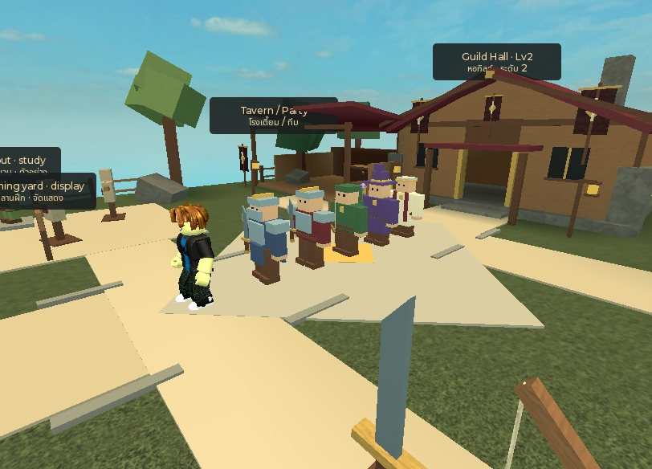
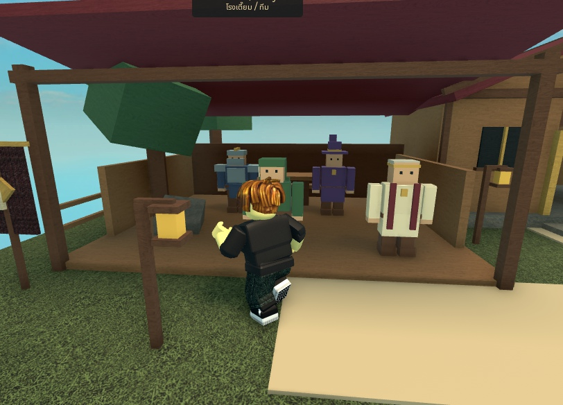
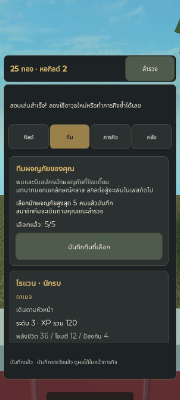
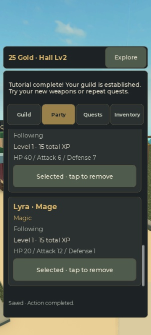
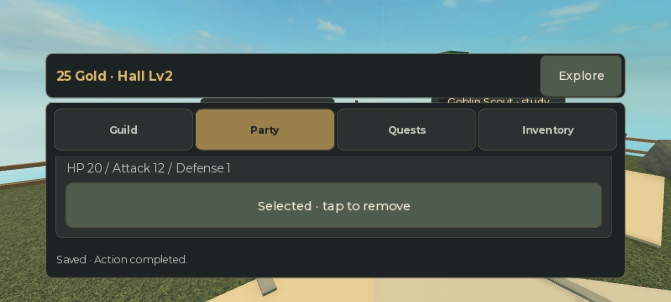

# Phase 1.6 — Visible Heroes & Party

Status: implemented and verified in Studio on 2026-09-28; not published. User closed Art Phase 1.5 and authorized Phase 1.6, then explicitly increased party capacity from three to **five**, in addition to the player guild leader. No combat, open-world zone, card packs, weekly rotation, ranks, cash-out or monetization is included.

## Scope

- Visible original low-poly Warrior, Archer, Priest, Knight and Mage models.
- Open-front tavern integrated with existing deterministic recruitment commands and Party screen.
- At most five owned, saved party members follow the guild leader through the existing hub.
- Owned non-party heroes rest at the tavern; unowned classes appear as recruitment candidates.
- Active expedition members leave the local world until the saved expedition is claimed; no double presence.
- Actual equipped item instances drive weapon visuals, including wood Training Sword versus Iron Sword.
- TH/EN UI, class/role names, status labels, prompts and persistent language preference.

## Content and compatibility

Five initial classes represent role identities: Warrior/Damage, Archer/Ranged, Priest/Healer, Knight/Tank and Mage/Magic. These are descriptive roles; healing, taunts, spells and combat AI are deferred to Phase 2. Players may select any one to five owned heroes without a required role composition. One recruit per class remains the existing model; class duplicates and extensive class trees are not introduced.

Knight (Bram) and Mage (Lyra) cost 20 Gold each and grant Knight Sword / Mage Staff inventory items. Players equip those through the existing Inventory screen. Neither recruit is required for the legacy tutorial/Hall upgrade. Existing three-class tutorial rewards, costs and deadlines remain unchanged. The original first-clear route still ends at Hall 2 with 10 Gold; optional recruits require extra earned Gold. There are now ten catalog items and five recruit definitions.

Content version is slice-1.6. Schema shape remains v1: existing records and slice-1.0 active quest snapshots remain valid without rewriting their rewards, deadlines or stats. Validation expands roster/party/active-snapshot bounds to five. Protocol, service and schema all enforce capacity and ownership. New records with Knight/Mage or five-member parties must not be opened by an old three-class deployment; forward-compatible deployment is required before publication, and rollback must retain the expanded reader. No publication is part of this task.

## Implementation boundaries

- HeroPresentation is a pure read-only projection of committed data, covered by standalone tests.
- WorldService owns one HeroService and retains plot lifecycle. NetworkService passes the same committed projection/status used by UI; no new RemoteEvents or reward authority.
- HeroRig constructs small R6-style Motor6D models and attaches cloned visual weapons with welds. Models contain no scripts or external animation dependencies.
- HeroService owns server Humanoids, collision groups, membership/status/gear synchronization and a shared 5 Hz follow scheduler. It follows a bounded 80-point trail behind the player, uses throttled pathfinding when blocked and has stuck/fall recovery. World geometry collides; heroes do not push each other or player characters. The hub remains the supported movement area.
- HeroAnimator drives cosmetic limb motion on the client, capped by view distance. It cannot change membership, rewards or authoritative positions.

The tavern is intentionally open-front for camera visibility. Recruitment remains a known purchase, not a random roll. Five candidates are the current catalog; the ten-per-week concept remains a future design decision.

## Validation

Automated gate: 40 tests passed, strict Roblox-aware analysis, all source compilation, Rojo build/source map and repository boundaries/links. New tests cover five-member ownership/equipment/active snapshots/rejoin, pure presentation and legacy content compatibility. Original tutorial, failure/replay/lease and translation scenarios remain green. Build: `build/Guildborne.rbxlx`.

Native Studio evidence:

- [Memory gameplay log](evidence/phase16-memory-native.txt): original onboarding/rejections followed by five-class recruitment, equipment, oversized/duplicate rejection, expedition disappearance/return and resting/following transitions. An initial QA observer incorrectly waited for a request ID on malformed packets; the harness was fixed to recognize the existing uncorrelated InvalidRequest response, then the run passed. No production networking change was needed.
- [Real persistent gameplay log](evidence/phase16-persistent-native.txt): the same legacy and five-class loops passed against a fresh Studio-only QA DataStore namespace. Gold was earned through real quest deadlines; no profile grants or resets were used. End of loop: revision 33, Hall 2, five equipped members, Thai.
- [Full checkpoint and restored data](evidence/phase16-rejoin.json): revision 34, active Quarry Patrol `q:8`, all five snapshot members, equipment, XP, inventory, Gold and Thai restored exactly across actual Stop/Play. MCP table serialization uses numeric-key objects whereas JSONEncode returns arrays; comparison normalized those representations and found zero field differences. All five heroes stayed hidden until the restored run was claimed; then five returned, revision 35, 25 Gold.
- [Movement and geometry](evidence/phase16-movement-geometry.txt): navigated plaza → quest-board turn → Hall entrance → interior → plaza. Five server-driven Humanoids moved and all five client shoulder joints animated. Idle recovery counts remained stable. A long teleport restored trail distances of approximately 4, 7.5, 11, 14.5 and 18 studs; respawn restored five followers. Native E on a tavern hero opened Party. The replication timing issue found in cosmetic animation was fixed by registering Motor6Ds as they arrive.
- Final Hall-2 full-party geometry: 424 parts versus a 650-part budget, 25 templates, four station prompts plus five hero prompts, zero lights/particle emitters, nine clear avatar-width route sweeps. Final QA server and client Output had no warnings/errors. These are scene checks, not a device frame-rate certification.
- Device Simulator: Thai 5/5 count and role text at 359×718, English fifth-card access by native scrolling, and landscape at 705×338 with persistent navigation and reachable controls. These are simulated viewports, not physical touch-device tests.
- [Original staging profile](evidence/phase16-legacy-profile.txt) loaded Active after normal configuration was restored: revision 40, 65 Gold, Hall 2, Thai, original three classes and active `q:9` unchanged. No mutation command was issued against it. Studio is stopped in Edit mode, and all 18 changed runtime sources plus normal Runtime were compared exactly with disk.

| Thai party | English fifth hero | English landscape scroll |
| --- | --- | --- |
|  |  |  |

## Handoff limits

The guild hub is the supported movement area. Followers wait at home when the leader is outside its bounds or unavailable; no open-world travel or combat is implied. Low-poly visuals and cosmetic motion are original procedural placeholders for later art expansion. The class catalog currently has five entries; broader customization and class specializations remain future work.

Published-client acceptance, physical mobile performance and two-player plot/isolation testing remain unverified for Phase 1.6. Multiplayer was already deferred for the Phase 1 solo handoff. No release, paid pack or economy integration was performed. The temporary QA namespace was confined to Studio and restored to the repository's normal staging configuration after testing.
