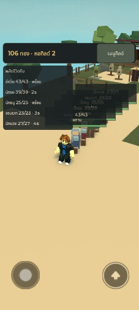
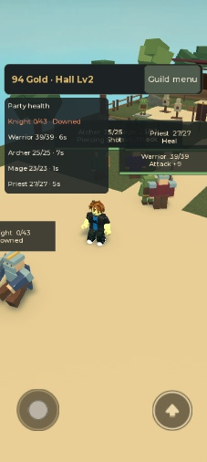
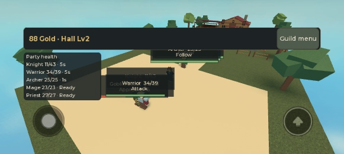
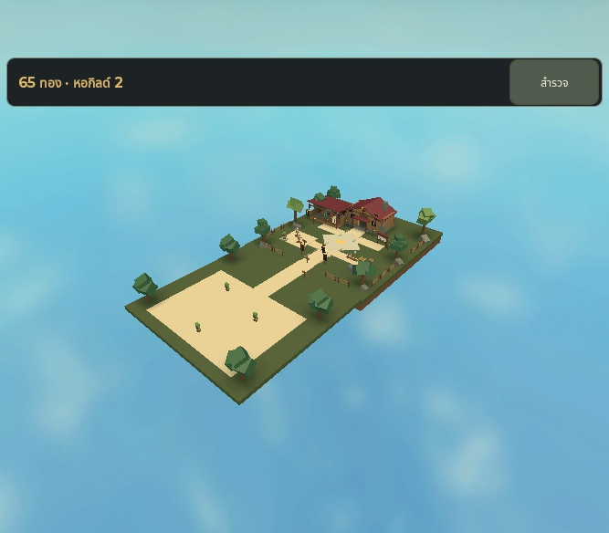

# Phase 2.1 — Studio test record

Executed 2026-09-28 through Roblox Studio MCP, Guildborne - Staging, place 86788611613035 / universe 10768425213. Client and Server contexts were both exercised. No publish occurred.

## Test setup and reproducibility

The first runs used fresh Memory storage. Persistence used a fresh, isolated Studio-only namespace `GB_Player_combat21_0928a_staging` and paired audit namespace, with the signed-in account. No existing staging profile was reset or granted resources directly. Recruitment funds came from real timed repeat quests. The temporary namespace change was confined to Studio, then restored from disk before handoff.

Run the existing [baseline client probe](../tests/studio_client_probe.luau) only against a fresh test profile, followed by [five-hero probe](../tests/studio_heroes_probe.luau). The latter leaves all five selected and equipped. Execute [combat sampler](../tests/studio_combat_probe.luau) in Server, then move the leader through Z=68 to Z=91 in its personal camp using MCP character navigation. It observes 600 samples; it does not grant damage, change enemy stats or award resources. Move to Z=32 to disengage and allow pending rewards/recovery to finish.

For persistence, capture the entire public `{revision,data}`, stop, start, then run [persistence probe](../tests/studio_persistence_probe.luau) in Client with stage inspect and that snapshot in `_G.GBPersistenceExpected`. Compare structurally, not JSON key ordering.

## Actual results

| Check | Result / evidence |
| --- | --- |
| Previous onboarding, three quests, first/repeat reward rules, equipment, Hall 2 | PASS in native Play; [baseline output](evidence/phase21-baseline.txt), [Memory output](evidence/phase21-memory-output.txt). Fresh isolated persistent run also completed baseline and five-hero assertions before combat. |
| Five-member recruitment, equipped visuals, party/expedition lifecycle, TH/EN | PASS using existing native probes and committed state. |
| All five basic attacks and starter abilities | PASS; [600-sample record](evidence/phase21-final-combat.json). Warrior 29 basic/9 ability, Archer 22/9, Knight 22/6, Priest 11/11, Mage 18/7 during that sample. |
| Ranged behavior / melee / tank / healing | PASS. Archer observed action distance up to 20.00 studs, Mage 18.50, Warrior 4.48. Knight taunt target observed; healing and damage both observed. These sampled distances are observations, not replacement range limits. |
| Enemy death, corpse/despawn/respawn and one reward per death | PASS. Final implementation ran repeated lifecycle cycles. Sample: 9 deaths/9 saved rewards. Extended pre-rejoin run: 24/24. |
| Downed heroes and recovery | PASS. Earlier isolated solo-Warrior probe: [downed evidence](evidence/phase21-downed.json). Final persistent run recorded two downed events; after withdrawal all five recovered to full HP and Follow: [return/respawn evidence](evidence/phase21-return-respawn.json). English portrait screenshot also shows an actual downed Knight. |
| Player respawn and pursuit end | PASS. Real LoadCharacterAsync, new leader at spawn, five following heroes, InCombat=false. No hero ownership loss. |
| Server network ownership | PASS assertion on unanchored hero roots throughout sampler; enemy roots anchored. |
| Forged combat commands | Seven native forged actions rejected without Gold/revision change in Memory run; matching domain tests pass. |
| Reward conservation / level updates | Gold 10→82 = 24×3; each participating hero +48 XP. Levels rose through existing progression rules. |
| Real DataStore Stop/Play | PASS: **EXACT REJOIN MATCH 58 en**. [Saved checkpoint](evidence/phase21-persistent-checkpoint.json), [rejoin output](evidence/phase21-rejoin.txt). Entire revision/data matched, not just Gold. |
| Mobile TH/EN | PASS native Device Simulator API, Samsung Galaxy A06, TouchEnabled=true, portrait358×718 / landscape705×338. All six panel labels reported TextFits=true. [Layout measurements](evidence/phase21-mobile-bounds.json). |
| Final Studio Output | No critical runtime errors: [final Output](evidence/phase21-final-output.txt). [Persistent combat Output](evidence/phase21-persistent-output.txt) also records checkpoint/audit events. |
| Source restoration | All runtime sources compared with repository after removing temporary QA namespace. Normal DataStore staging configuration, Play stopped, device simulation reset to default. |

Final read-only normal-staging smoke test loaded the original profile unchanged: revision 40, Gold 65, Hall 2, active quest q:9. The camp overview screenshot comes from that restored profile. The [final automated validation output](evidence/phase21-validation.txt) records 59 passing scenarios, 20 required documents, 152 valid local links and 43 strict runtime source files.

The landscape adjustment uses 18 px rows (112 px total panel) instead of portrait's 27 px rows (166 px). In the measured landscape layout the panel ends at y=176, while the visible thumbstick begins at y≈187. The larger transparent dynamic-thumbstick input region extends behind the panel; the panel is non-interactive. Default StarterGui orientation is Sensor, and combat ScreenGui uses CoreUISafeInsets. Portrait and landscape were both inspected with actual touch controls.

## Screenshots captured

These are actual MCP viewport captures. Device FitToWindow scales image pixels; the measured viewport sizes above are authoritative. Camera positioning was used only for inspection; combat stats, HP and rewards were not altered for the screenshots. Captures were taken at different points, so Gold and cooldowns differ.

| Thai portrait | English portrait, downed Knight |
| --- | --- |
|  |  |

## Corrections and limits

The legacy Studio toolbar initially showed a phone name while the active simulator was default. Those desktop observations were not counted as mobile passes. The Roblox [device simulation API](https://create.roblox.com/docs/reference/engine/classes/StudioDeviceSimulatorService) and `rbx-device-simulator-lua` skill were then used to activate the actual phone device and verify touch/viewport state. Native Windows controls were used during diagnosis; final mobile evidence comes from the MCP API.

Inspection caught landscape HP-panel/joystick overlap; row spacing was reduced and rechecked in a fresh Play session. The downed HUD now explicitly says Downed instead of Ready. Old follower nameplates are hidden while combat nameplates are active. Corpse despawn/cleanup and participant capture were tightened before the final persistent combat run.

Earlier compile/type-check failures were fixed and the complete automated gate rerun successfully. A Studio Assistant message resetting an inspection camera from Scriptable to Custom is tool behavior, not a runtime game error. Final Output contains no critical errors.

These checks do not certify a physical phone, published Roblox Player, multiple concurrent players, network impairment or a production load budget. Those remain explicitly unverified. See [implementation limitations](PHASE2_1_IMPLEMENTATION.md). Phase 2.1 is complete for this scope; Phase 2.2 is not authorized.
