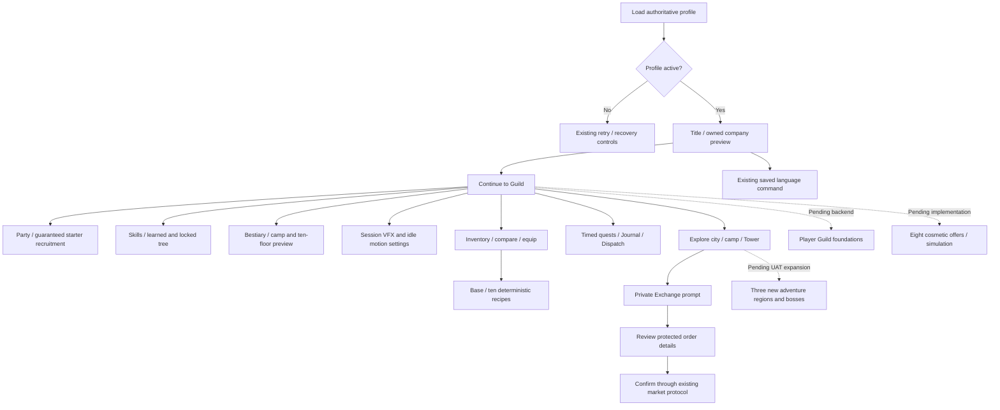

# UX flow and implementation map

The desired first-session route remains: title → recruit → choose party → adventure → skills → boss → loot → craft → equip/upgrade → city → Player Guild → save/rejoin. The new pictures do not close the incomplete gameplay milestones.

Title: valid profile enables Continue, never a reset. Owned model preview supports horizontal drag; Continue destroys its WorldModel and input subscriptions. Failure exposes existing recovery UI. Loading has no fake percentage. Language uses SetLanguage, not a local-only mock preference.

Skills: graph shows vitality → focus/ward (exclusive) and vitality → path_art → master_art. Learned nodes are gold, available nodes burgundy, blocked nodes navy with a reason. The graph computes presentation only. LearnSkill remains validated server-side for ownership, tier, prerequisites, points, branch exclusion, active Tower encounter and persistence. Class text now correctly states 30/70.

Inventory: names, stats, quantities, ownership, tradeability and prices remain live catalog/profile text. Existing equip/transfer/sale confirmation is retained. An uploaded artwork failure must not hide an item's label or action. Only stone, timber, iron_ore, iron_ingot and herb are market-listed materials.

Quest/NPC: preserve actual Journal/expedition objectives and claim-once behavior. New NPC images communicate roles, but do not invent dialogue or rewards in production. Market uses the existing station and protocol; read-only, paused, empty and pending-claim states stay explicit.

Mobile: use scrollable native content and at least 48px actions. The current short Studio viewport was tested for a few mouse paths only. Portrait/touch acceptance, comprehensive persistent Settings, selected-companion skill HUD and complete gallery-to-game migration remain pending.

Avatar combat: F basic, Q starter, Z learned path art, X learned master art. Touch uses four 52px buttons; short viewports use two columns. Locked slots carry text, not false cooldowns. Server chooses the ability from committed progression; all arts keep the existing shared cooldown. No-parent prestige paths keep slot 2 empty. Inventory sorting uses catalog stats and translated names; market eligibility does not imply public market availability.

Content progression now includes eleven additional Journal goals (eighteen total quests) and fourteen new bound equipment definitions (thirty total items). Base lists ten recipes and checks forge/Hall/material requirements. Journal prerequisites name the required quest; state goals honor existing achievements. See CONTENT_DELIVERY.md.
